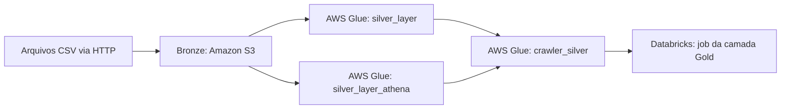

# Pipeline de dados com Apache Airflow, AWS e Databricks

Projeto de engenharia de dados que utiliza o Apache Airflow para orquestrar a ingestão de dados de reservas, passageiros e aeroportos, integrando Amazon S3, AWS Glue e Databricks em um fluxo organizado nas camadas Bronze, Silver e Gold.

O ambiente local executa em containers Docker, com CeleryExecutor, Redis e PostgreSQL. O processamento na nuvem depende de recursos previamente configurados na AWS e no Databricks.

## Arquitetura



O Airflow coordena todas as etapas. Os dois jobs da camada Silver executam em paralelo; o crawler é iniciado após o sucesso de ambos. Em seguida, a DAG solicita a execução do job no Databricks.

## Etapas do pipeline

| Task | Responsabilidade |
| --- | --- |
| `extract_load` | Baixa `bookings.csv`, `passengers.csv` e `airports.csv`, lê os dados com pandas e grava os CSVs no S3. |
| `transform_load_s3` | Inicia o job Glue `silver_layer`, passando o argumento `--load_date`, e aguarda seu sucesso. |
| `transform_load_s3_parquet` | Inicia o job Glue `silver_layer_athena`, destinado à saída em Parquet, e aguarda seu sucesso. |
| `trigger_crawler` | Inicia o crawler `crawler_silver` e consulta seu estado até retornar a `READY`. |
| `trigger_databricks_job` | Solicita a execução do job Databricks responsável pela camada Gold e retorna o identificador da execução. |

Os arquivos da Bronze são gravados na estrutura:

```text
s3://<seu-bucket>/bronze/AAAA-MM-DD/
├── bookings.csv
├── passengers.csv
└── airports.csv
```

A data da pasta é calculada no momento da extração e compartilhada com as tasks Silver via XCom. A DAG `aws_project` tem agendamento diário (`@daily`), e cada task permite três novas tentativas com intervalo de cinco segundos.

## Tecnologias

- **Apache Airflow 3.3.1:** versão declarada na imagem base do projeto.
- **Docker Compose:** execução dos serviços locais.
- **PostgreSQL 16 e Redis 7.2:** metadados do Airflow e broker do Celery.
- **Python, pandas e requests:** download e leitura dos CSVs.
- **boto3 e AWS Glue:** integração com S3, jobs e crawler.
- **Databricks SDK:** disparo do job da camada Gold.
- **dotenv:** carregamento das variáveis de ambiente.

## Estrutura do projeto

```text
.
├── dags/
│   └── aws_project.py       # DAG e dependências entre as tasks
├── utils/
│   ├── __init__.py
│   ├── bronze_layer.py     # Download dos CSVs e upload para o S3
│   ├── silver_layer.py     # Disparo e acompanhamento do Glue
│   └── gold_layer.py       # Disparo do job Databricks
├── config/
│   └── airflow.cfg         # Configuração local do Airflow
├── docker-compose.yaml     # Serviços e volumes
├── dockerfile              # Imagem do Airflow com dependências
├── requirements.txt        # Dependências Python adicionais
└── README.md
```

As pastas `logs/`, `plugins/` e `data/` também são utilizadas como volumes pelo Compose. O arquivo `.env` deve ser criado localmente.

## Pré-requisitos

- Docker com suporte a containers Linux e Docker Compose.
- Recursos locais compatíveis com as verificações do Compose: 4 GB de memória, 2 CPUs e 10 GB de disco disponível.
- Acesso aos CSVs de origem pela internet.
- Um bucket S3 e os jobs/crawler do Glue configurados em `us-east-1`.
- Credenciais AWS com acesso aos recursos usados pelo pipeline.
- Workspace Databricks com um job existente e token com permissão para executá-lo.

**Os scripts Spark, notebooks, regras de transformação e provisionamento da infraestrutura não estão incluídos neste repositório.** É necessário preparar esses componentes antes de executar o fluxo completo.

## Configuração

### 1. Preparar os recursos na nuvem

Crie ou adapte os seguintes recursos e atualize as referências no código:

| Recurso | Valor presente no código | Local de configuração |
| --- | --- | --- |
| Bucket S3 | `airflow-aws-course-bucket` | `dags/aws_project.py` |
| Região AWS | `us-east-1` | `utils/bronze_layer.py` e `utils/silver_layer.py` |
| Job Glue | `silver_layer` | `dags/aws_project.py` |
| Job Glue para Parquet | `silver_layer_athena` | `dags/aws_project.py` |
| Crawler Glue | `crawler_silver` | `dags/aws_project.py` |
| ID do job Databricks | `750378970164515` | `dags/aws_project.py` |

Os jobs Glue devem aceitar o argumento `--load_date`, com formato `AAAA-MM-DD`, e processar a pasta correspondente da Bronze. Configure o crawler para os dados produzidos pelos jobs e prepare o job Databricks para consumir a saída esperada. Os caminhos Silver/Gold e os schemas dependem dessas implementações externas.

Existem também valores de exemplo nos blocos `if __name__ == "__main__"` dos utilitários; ajuste-os caso execute esses arquivos diretamente.

### 2. Criar o arquivo `.env`

Na raiz do projeto, crie um `.env` com os campos abaixo, substituindo os valores de exemplo. Preserve a capitalização dos nomes, pois o código utiliza essas chaves exatamente como escritas.

```dotenv
AIRFLOW_UID=50000
FERNET_KEY=<chave-fernet-gerada>
AIRFLOW__API_AUTH__JWT_SECRET=<segredo-aleatorio>

_AIRFLOW_WWW_USER_USERNAME=airflow
_AIRFLOW_WWW_USER_PASSWORD=<senha-local>

aws_access_key_id=<sua-access-key>
aws_secret_access_key=<sua-secret-key>

Databricks_HOST=https://<seu-workspace-databricks>
Databricks_PAT=<seu-token>
```

No Linux, utilize o resultado de `id -u` em `AIRFLOW_UID`. No Windows, mantenha `50000`.

Para gerar a chave Fernet e o segredo JWT usando a imagem base declarada no projeto:

```bash
docker run --rm --entrypoint python apache/airflow:3.3.1 -c "from cryptography.fernet import Fernet; print(Fernet.generate_key().decode())"
docker run --rm --entrypoint python apache/airflow:3.3.1 -c "import secrets; print(secrets.token_urlsafe(32))"
```

Copie cada resultado para o campo correspondente no `.env`. O Compose injeta essas variáveis nos containers.

### 3. Construir a imagem

Execute os comandos a partir da raiz do projeto:

```bash
docker compose build
```

O arquivo de build está nomeado `dockerfile`, em letras minúsculas. Se o Docker não o encontrar em um sistema com distinção entre maiúsculas e minúsculas, substitua `build: .` em `x-airflow-common` no Compose por:

```yaml
build:
  context: .
  dockerfile: dockerfile
```

### 4. Inicializar e iniciar os serviços

```bash
docker compose up airflow-init
docker compose up -d
docker compose ps
```

Após a conclusão bem-sucedida da inicialização e a subida dos serviços, acesse **http://localhost:8080** e entre com o usuário e a senha definidos no `.env`.

## Execução e acompanhamento

Na interface do Airflow, localize a DAG **`aws_project`** e utilize a opção de execução manual para iniciar o pipeline. Acompanhe o grafo e os logs de cada task.

**A DAG está configurada com `is_paused_upon_creation=False`**, portanto pode iniciar automaticamente pelo agendamento ao ser carregada. Configure os recursos e as credenciais antes de subir o ambiente.

Para consultar os logs dos serviços:

```bash
docker compose logs -f airflow-scheduler airflow-worker airflow-dag-processor
```

Para conferir o resultado:

1. Verifique os três CSVs no prefixo `bronze/AAAA-MM-DD/` do bucket.
2. Consulte as execuções dos dois jobs no AWS Glue.
3. Confira a última execução do crawler e as tabelas no Glue Data Catalog.
4. Acompanhe o identificador retornado pela task final no workspace Databricks.

A task do Databricks **apenas dispara o job; não aguarda sua conclusão**. O sucesso dessa task confirma a solicitação de execução, e o resultado do processamento Gold deve ser verificado no Databricks.

Para parar o ambiente local, preservando o volume do PostgreSQL:

```bash
docker compose down
```

## Comportamentos e limitações

- A data de ingestão usa o relógio da execução, e não a data lógica do Airflow. Reexecuções no mesmo dia utilizam as mesmas chaves S3 e sobrescrevem os arquivos correspondentes.
- O acompanhamento dos jobs Glue consulta o status a cada 30 segundos. O código trata explicitamente `SUCCEEDED`, `FAILED` e `STOPPED`, mas não define um limite total de espera nem trata todos os estados terminais.
- O crawler é considerado concluído ao voltar a `READY`; o código não verifica o resultado de `LastCrawl`.
- Os nomes dos recursos e a região estão definidos diretamente no código.
- O Compose foi preparado para desenvolvimento local. A execução das etapas na nuvem utiliza recursos da sua conta AWS e do seu workspace Databricks.

## Publicação no GitHub

Mantenha credenciais e arquivos gerados fora do versionamento. Antes do primeiro commit, crie ou adapte um `.gitignore` com, por exemplo:

```gitignore
.env
.env.*
!.env.example
logs/
__pycache__/
*.py[cod]
.venv/
venv/
```

Se desejar disponibilizar um modelo de configuração, crie um `.env.example` contendo somente os nomes das variáveis e valores fictícios apresentados neste README.

## Origem dos dados

As URLs configuradas na DAG apontam para os arquivos `bookings.csv`, `passengers.csv` e `airports.csv` do repositório [anshlambagit/ApacheAirflow](https://github.com/anshlambagit/ApacheAirflow). Os arquivos são obtidos por HTTP a cada execução da extração.
